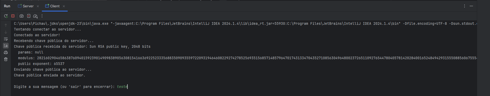
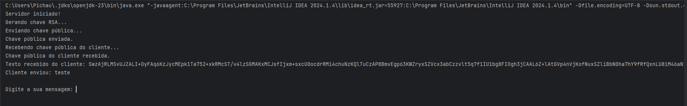

<h1>Integrantes</h1>

Denner de Oliveira Duarte - RM551938

Lucas Petroni - RM 97861

Matheus Paulo de Lima Delgado - RM552189

Nathaly Oliveira - RM552538

Caio Boris Andrulis - RM552496

<h1>Sistema de encriptação de dados via conexão TCP/IP</h1>

Este projeto tem como principal funcionalidade, realizar a encriptação de dados atrás do algoritmo RSA.

<h1>IDE Utilizada</h1>

Intellij

<h2>Funcionalidades</h2>
<ul>
    <li>Encriptar dados enviados pelo cliente</li>
</ul>

<h2>Imagens</h2>
<ul>
    <li>
        
<strong>Resposta do Cliente:</strong>

        
    </li>
    <li>
        
<strong>Resposta do Servidor:</strong>

        
    </li>
</ul>
